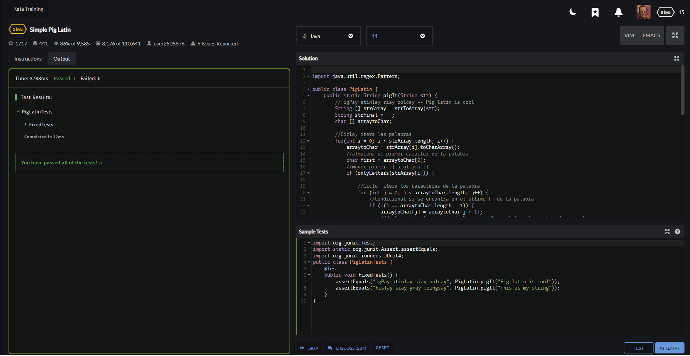
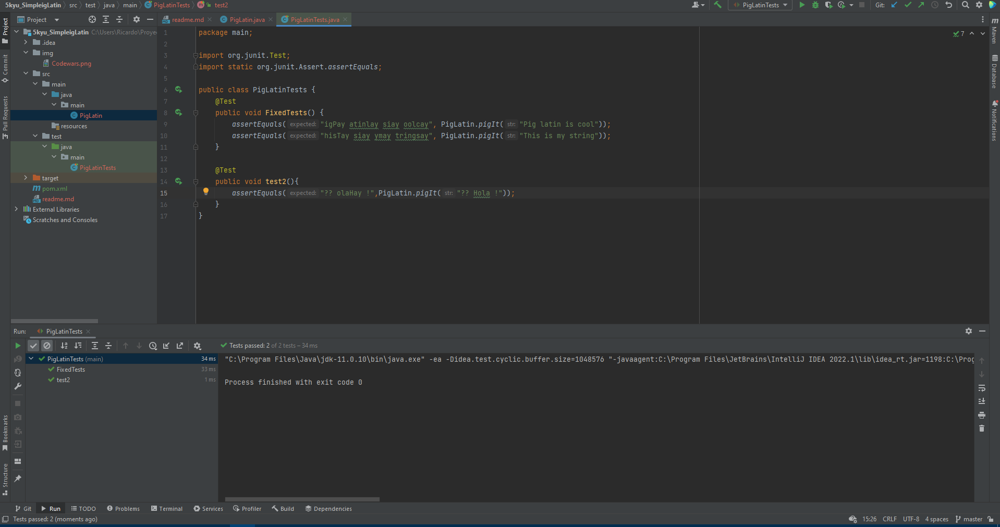

## Simple ig Latin
#### Estado: Completado
#### Level: 5 kyu

Move the first letter of each word to the end of it, then add "ay" to the end of the word. Leave punctuation marks untouched.

##### Example
```java
pigIt('Pig latin is cool'); // igPay atinlay siay oolcay
pigIt('Hello world !');     // elloHay orldway !
```
#### Codewars


#### IntelliJ

##### Tests
- FixedTest() : Comprueba el funcionamiento del metodo solicitado en base a letras
- test2(): Comprueba el funcionamiento del metodo solicitado en base a letras y expresiones como: `? y !`