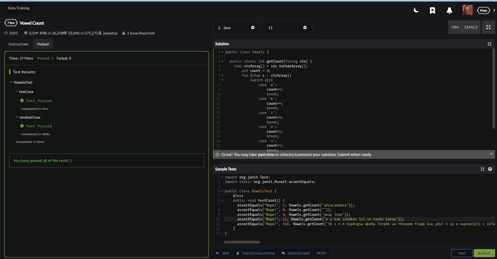
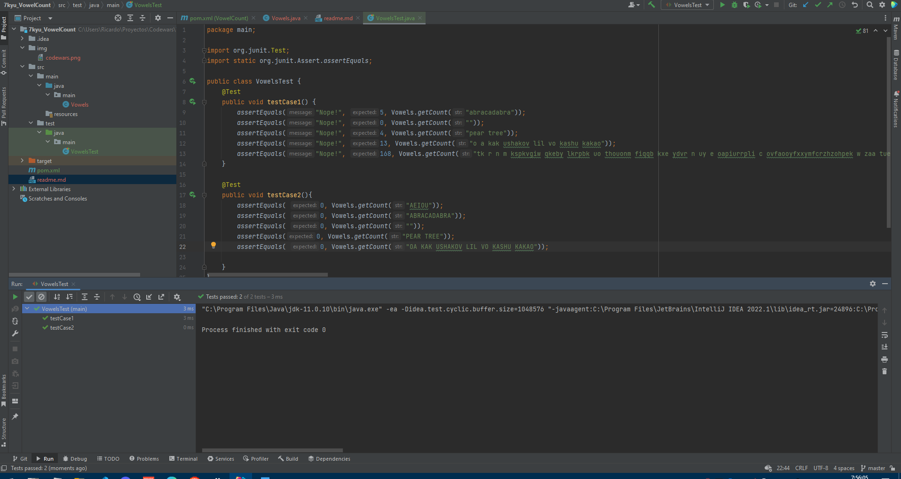

## Vowel Count
#### Level: 7 kyu
#### Estado: Completado
Return the number (count) of vowels in the given string.
We will consider `a, e, i, o, u` as vowels for this Kata (but not y).
The input string will only consist of lower case letters and/or spaces.

#### Codewars

#### IntelliJ

###### Test
Se realizan dos test
 - testCase1: Comprueba la obtención de vocales, utilizando letras en minúscula y espacios
 - testCase2: Comprueba la obtención de vocales, utililizando letras en mayúscula y espacios