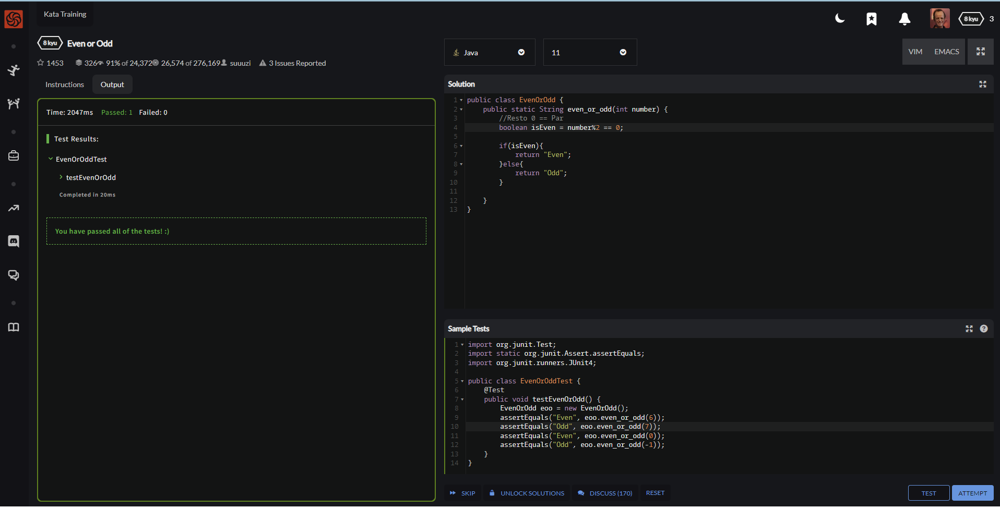
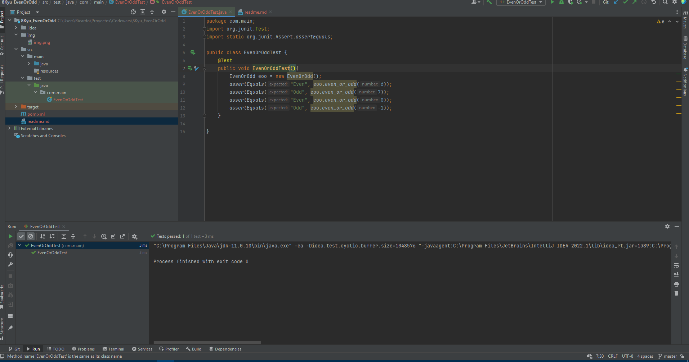

## Even or Odd
#### Level: 8 kyu
#### Estado: Completado
Create a function that takes an integer as an argument and returns "Even" for even numbers or "Odd" for odd numbers.

#### Test on Codewar

#### IntelliJ

##### Test

- EvenOrOddTest: Se realiza una comprobación del funcionamiento del programa en base a números pares e impares
